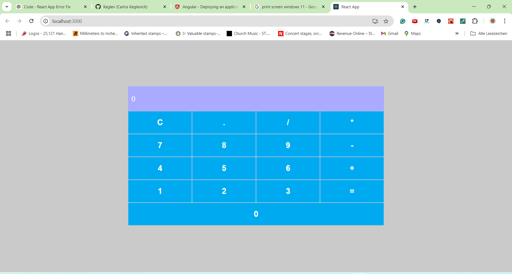

## About
A simple Math calculator. 

# Calculator App

This simple calculator is for basic Math operations only. 

# Table of Contents

[Features](#Features) 

[Screenshots](#Screenshots)

[Installation](#Instalation)

[Usage](#Usage)

[Available Scripts](#Available-Scripts)

[Technologies](#Technologies)

[Contributing](#Contributing)

# Features

The calculator performs basic math calculations.
clean design, no distractions
It accepts inputs from the screen (mouse-click) and the keyboard
This does not accept input from letters

# Screenshots

# Installation
To run this app locally, follow these steps:

1. Clone the repository:

  git clone https://github.com/your-username/restaurant-finder-app.git

2. Navigate to the project directory:
   
  cd restaurant-finder-app

3. Install the dependencies:

   npm install

## Usage

 This is a simple calculator. Mimics the Windows calculator 
 This is not intended for scientific calculation
 
# Getting Started with Create React App

This project was bootstrapped with [Create React App](https://github.com/facebook/create-react-app).

## Available Scripts

In the project directory, you can run:

### `npm start`

Runs the app in the development mode.\
Open [http://localhost:3000](http://localhost:3000) to view it in your browser.

The page will reload when you make changes.\
You may also see any lint errors in the console.

### `npm test`

Launches the test runner in the interactive watch mode.\
See the section about [running tests](https://facebook.github.io/create-react-app/docs/running-tests) for more information.

### `npm run build`

Builds the app for production to the `build` folder.\
It correctly bundles React in production mode and optimizes the build for the best performance.

The build is minified and the filenames include the hashes.\
Your app is ready to be deployed!

See the section about [deployment](https://facebook.github.io/create-react-app/docs/deployment) for more information.

### `npm run eject`

**Note: this is a one-way operation. Once you `eject`, you can't go back!**

If you aren't satisfied with the build tool and configuration choices, you can `eject` at any time. This command will remove the single build dependency from your project.

Instead, it will copy all the configuration files and the transitive dependencies (webpack, Babel, ESLint, etc) right into your project so you have full control over them. All of the commands except `eject` will still work, but they will point to the copied scripts so you can tweak them. At this point you're on your own.

You don't have to ever use `eject`. The curated feature set is suitable for small and middle deployments, and you shouldn't feel obligated to use this feature. However we understand that this tool wouldn't be useful if you couldn't customize it when you are ready for it.

## Learn More

You can learn more in the [Create React App documentation](https://facebook.github.io/create-react-app/docs/getting-started).

To learn React, check out the [React documentation](https://reactjs.org/).

### Code Splitting

This section has moved here: [https://facebook.github.io/create-react-app/docs/code-splitting](https://facebook.github.io/create-react-app/docs/code-splitting)

### Analyzing the Bundle Size

This section has moved here: [https://facebook.github.io/create-react-app/docs/analyzing-the-bundle-size](https://facebook.github.io/create-react-app/docs/analyzing-the-bundle-size)

### Making a Progressive Web App

This section has moved here: [https://facebook.github.io/create-react-app/docs/making-a-progressive-web-app](https://facebook.github.io/create-react-app/docs/making-a-progressive-web-app)

### Advanced Configuration

This section has moved here: [https://facebook.github.io/create-react-app/docs/advanced-configuration](https://facebook.github.io/create-react-app/docs/advanced-configuration)

## Technologies:

Frontend: *React, React Router

Backend: *JavaScript

Styling: *CSS

## Contributing

Contributions are welcome! Here's how you can contribute:

1. Fork the repository.
2. Create a new branch (git checkout -b feature/YourFeatureName).
3. Commit your changes (git commit -m 'Add some feature').
4. Commit your changes (git commit -m 'Add some feature').
5. Open a pull request.
